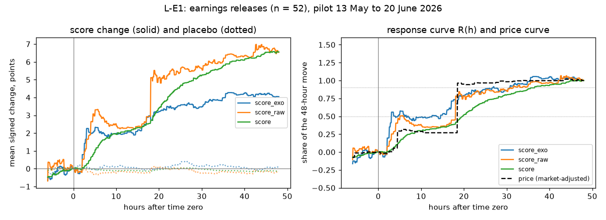
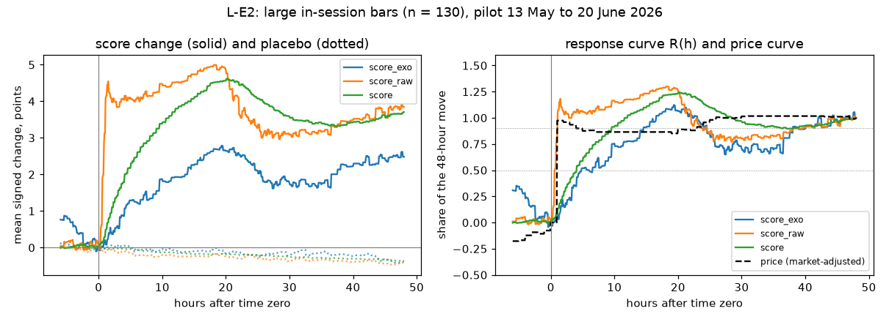
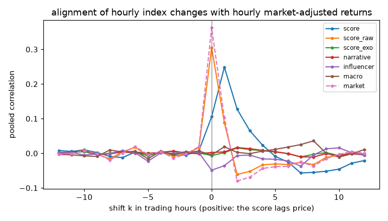

# Experiment 5B, pilot results: how quickly does the score respond?

Rendered by `python -m lag.scripts.render_results` from the files in `results/`. The measurement is specified in [BRIEF.md](BRIEF.md) and every choice in [DECISIONS.md](DECISIONS.md). This experiment measures response times; it has no pass or fail and says nothing about usefulness.

> **The published composite `score` was smoothed with a 4-hour half-life in this period (12 May to 22 June 2026). The system has used a 2-hour half-life since 22 July 2026, so the timings of `score` here are not those of the system today.** The unsmoothed composite (`score_raw`), `score_exo` and the four channels are not smoothed and are unaffected.

## 1. Summary

Pilot period: events with time zero from 2026-05-13 to 48 hours before the last tick (2026-06-22 23:30 UTC), 473 stocks, hourly price bars. Events: 52 earnings releases (L-E1, all outside the session) and 130 large in-session bars (L-E2, rarity threshold |z| > 5.15; DECISIONS.md L14).

Primary cells (score_exo and score_raw, each on L-E1 and on L-E2):

- **score_exo (without the market channel), earnings releases (n = 52):** eventual move M = 4.05 points; gate **interpreted**: relabelling p = 0.003 (passes); bootstrap interval for M 0.27 to 8.11 (above zero); synthetic null, 1,000 no-response worlds: relabelling p < 0.05 alone 6.8% false positives; combined gate 4.8%. Half response T½ = 3.05 h (2.51 h to 17.78 h); full response T₉₀ = 26.77 h (2.55 h to 35.57 h); first response at 4 h; share of the price move already done at T½: 0.01 (-0.05 to 0.45).
- **score_raw (unsmoothed composite), earnings releases (n = 52):** eventual move M = 6.54 points; gate **interpreted**: relabelling p = < 0.001 (passes); bootstrap interval for M 3.38 to 10.23 (above zero); synthetic null, 1,000 no-response worlds: relabelling p < 0.05 alone 6.8% false positives; combined gate 4.8%. Half response T½ = 5.07 h (3.55 h to 18.06 h); full response T₉₀ = 30.83 h (18.05 h to 42.52 h); first response at 4 h; share of the price move already done at T½: 0.29 (-0.00 to 0.42).
- **score_exo (without the market channel), large in-session price bars (n = 130):** eventual move M = 2.48 points; gate **interpreted**: relabelling p = 0.003 (passes); bootstrap interval for M 0.63 to 4.43 (above zero); synthetic null, 1,000 no-response worlds: relabelling p < 0.05 alone 6.8% false positives; combined gate 4.8%. Half response T½ = 4.79 h (1.58 h to 13.96 h); full response T₉₀ = 14.57 h (3.32 h to 44.88 h); first response at 8 h; share of the price move already done at T½: 0.90 (0.76 to 1.09).
- **score_raw (unsmoothed composite), large in-session price bars (n = 130):** eventual move M = 3.85 points; gate **interpreted**: relabelling p = < 0.001 (passes); bootstrap interval for M 2.25 to 5.57 (above zero); synthetic null, 1,000 no-response worlds: relabelling p < 0.05 alone 6.8% false positives; combined gate 4.8%. Half response T½ = 37 min (32 min to 50 min); full response T₉₀ = 1.03 h (45 min to 9.58 h); first response at 30 min; share of the price move already done at T½: 0.00 (0.00 to 0.00) (T½ is shorter than one 60-minute bar: zero by construction).

Every time above is read against its resolution: 15-minute ticks in session (30 before 18 May), 30-minute ticks outside, 60-minute bars. T½ and T₉₀ are interpolated between 5-minute grid points of a step function, so a jump exactly on a tick is reported up to half a tick early.

## 2. Run metadata

| | |
|---|---|
| started (UTC) | 2026-10-09T08:04:48+00:00 |
| run time | 40 s |
| code commit | 13052e5 |
| config hash | 170ea81f068c |
| data hash (ticks and hourly bars) | 83b94ae480a8 |
| seed | 20260513 |
| relabellings K / bootstrap B / placebo per event | 1000 / 2000 / 20 |
| ticks read | 1,569,507 (0 with score_raw rebuilt from channels) |
| python / numpy / pandas | 3.14.6 / 2.5.3 / 3.0.6 |

## 3. Counts

| | |
|---|---|
| L-E1 events (earnings with a time) | 52 (inside session 0, outside 52) |
| L-E2 events (rarity rule) | 130 (all inside the session) |
| L-E2 events under the 3x sensitivity rule | 1261 |
| events with a fresh before reading (L6) | 182 of 182 (0 stale) |
| events without a placebo pool | 0 (median pool 20 sessions) |
| bars without a close-to-close return | 473 (the first bar of each stock's store) |
| cells measured | 12 (59 secondary index-cells with a p-value) |

Event construction, drops and clustering: [results/event_counts.md](results/event_counts.md). Tick spacing: [results/tick_check.md](results/tick_check.md). Bar coverage: [results/coverage_1h.md](results/coverage_1h.md).

## 4. Decisions

All in [DECISIONS.md](DECISIONS.md): L1 to L13 before the Phase 0 counts, L14 (the L-E2 rarity threshold and the separate primary cells) after the counts and before any response, L15 and L16 while building the measurement on synthetic data, and L17 (the combined gate) after the pre-pilot null check and before this run. The brief's checks on synthetic data are in [results/phase1_synthetic.md](results/phase1_synthetic.md); the pre-pilot null check in [results/null_check.md](results/null_check.md).

**Gate (L17) and its null rates.** An index's timings are interpreted only if its relabelling p for M is below 0.05 and the date-bootstrap 95% interval for M lies above zero. On 1,000 synthetic worlds with no response, the relabelling condition alone passed 6.8% of the time (outside the 3.6% to 6.4% band agreed before the check) and the combined gate 4.8%. Both rates are repeated next to every gate decision below.

> **Note added 10 October 2026.** The 6.8% above is the rate of a single seed. Over five independent seeds (5,000 worlds in all) the same scenario gives 4.4%, and the walk-only and white-noise-only scenarios 4.5% and 4.2%: the pre-pilot figure was a seed fluctuation and the relabelling test is left as specified. Details in [results/null_investigation.md](results/null_investigation.md) and DECISIONS.md (open item, closed). No number in this document was changed; a rerun of the pre-pilot check with the current code reproduces it.

## 5. Primary measures

| cell | index | n | M (points) | p(M) | M interval | gate (L17) | T½ | T₉₀ | first response | Rₚ(T½) | corr. with price? |
|---|---|---|---|---|---|---|---|---|---|---|---|
| L-E1, all | score_exo | 52 | 4.05 | 0.003 | 0.27 to 8.11 | interpreted | 3.05 h (2.51 h to 17.78 h) | 26.77 h (2.55 h to 35.57 h) | 4 h | 0.01 (-0.05 to 0.45) |  |
| L-E1, all | score_raw | 52 | 6.54 | < 0.001 | 3.38 to 10.23 | interpreted | 5.07 h (3.55 h to 18.06 h) | 30.83 h (18.05 h to 42.52 h) | 4 h | 0.29 (-0.00 to 0.42) |  |
| L-E2, all | score_exo | 130 | 2.48 | 0.003 | 0.63 to 4.43 | interpreted | 4.79 h (1.58 h to 13.96 h) | 14.57 h (3.32 h to 44.88 h) | 8 h | 0.90 (0.76 to 1.09) |  |
| L-E2, all | score_raw | 130 | 3.85 | < 0.001 | 2.25 to 5.57 | interpreted | 37 min (32 min to 50 min) | 1.03 h (45 min to 9.58 h) | 30 min | 0.00 (0.00 to 0.00) (T½ is shorter than one 60-minute bar: zero by construction) |  |

Gate decisions, with the null rates (synthetic null, 1,000 no-response worlds: relabelling p < 0.05 alone 6.8% false positives; combined gate 4.8%):

- L-E1, score_exo: **interpreted**: relabelling p = 0.003 (passes); bootstrap interval for M 0.27 to 8.11 (above zero); synthetic null, 1,000 no-response worlds: relabelling p < 0.05 alone 6.8% false positives; combined gate 4.8%
- L-E1, score_raw: **interpreted**: relabelling p = < 0.001 (passes); bootstrap interval for M 3.38 to 10.23 (above zero); synthetic null, 1,000 no-response worlds: relabelling p < 0.05 alone 6.8% false positives; combined gate 4.8%
- L-E2, score_exo: **interpreted**: relabelling p = 0.003 (passes); bootstrap interval for M 0.63 to 4.43 (above zero); synthetic null, 1,000 no-response worlds: relabelling p < 0.05 alone 6.8% false positives; combined gate 4.8%
- L-E2, score_raw: **interpreted**: relabelling p = < 0.001 (passes); bootstrap interval for M 2.25 to 5.57 (above zero); synthetic null, 1,000 no-response worlds: relabelling p < 0.05 alone 6.8% false positives; combined gate 4.8%

M is the mean signed change of the index 48 hours after time zero, in points on the 0 to 100 scale; p(M) is the relabelling p-value (K = 1,000, 5A's test) and the M interval the date-bootstrap 95% interval (B = 2,000); the gate is both together (L17). Timing intervals are the same bootstrap. The first response is the earliest main horizon whose mean is above the relabelling null after a Holm adjustment across the eight horizons. Rₚ(T½) is the share of the 48-hour market-adjusted price move already done at the first grid point where the score has reached half of its move (L16).

### L-E1 at the main horizons

**score_exo (without the market channel)**

| horizon | mean m(h), points | placebo mean | R(h) | p (relabelling) | Holm p |
|---|---|---|---|---|---|
| 15 min | -0.01 | 0.01 | -0.00 | 0.549 | 1.000 |
| 30 min | -0.14 | 0.06 | -0.03 | 0.803 | 1.000 |
| 1 h | -0.05 | 0.11 | -0.01 | 0.608 | 1.000 |
| 2 h | -0.14 | 0.18 | -0.04 | 0.656 | 1.000 |
| 4 h | 2.02 | 0.03 | 0.50 | 0.002 | 0.014 |
| 8 h | 1.79 | 0.12 | 0.44 | 0.004 | 0.020 |
| 24 h | 3.42 | 0.22 | 0.84 | < 0.001 | 0.008 |
| 48 h | 4.05 | 0.09 | 1.00 | 0.003 | 0.018 |

**score_raw (unsmoothed composite)**

| horizon | mean m(h), points | placebo mean | R(h) | p (relabelling) | Holm p |
|---|---|---|---|---|---|
| 15 min | 0.04 | -0.06 | 0.01 | 0.413 | 1.000 |
| 30 min | -0.21 | -0.11 | -0.03 | 0.832 | 1.000 |
| 1 h | 0.04 | -0.02 | 0.01 | 0.448 | 1.000 |
| 2 h | -0.21 | -0.04 | -0.03 | 0.691 | 1.000 |
| 4 h | 1.90 | -0.16 | 0.29 | < 0.001 | 0.008 |
| 8 h | 2.54 | -0.21 | 0.39 | < 0.001 | 0.008 |
| 24 h | 5.29 | 0.04 | 0.81 | < 0.001 | 0.008 |
| 48 h | 6.54 | -0.21 | 1.00 | < 0.001 | 0.008 |

### L-E2 at the main horizons

**score_exo (without the market channel)**

| horizon | mean m(h), points | placebo mean | R(h) | p (relabelling) | Holm p |
|---|---|---|---|---|---|
| 15 min | -0.08 | -0.02 | -0.03 | 0.813 | 1.000 |
| 30 min | 0.01 | -0.01 | 0.00 | 0.519 | 1.000 |
| 1 h | 0.20 | -0.03 | 0.08 | 0.178 | 0.533 |
| 2 h | 0.42 | 0.06 | 0.17 | 0.093 | 0.372 |
| 4 h | 0.86 | 0.06 | 0.35 | 0.013 | 0.065 |
| 8 h | 1.33 | -0.06 | 0.53 | 0.007 | 0.042 |
| 24 h | 2.28 | -0.18 | 0.92 | 0.003 | 0.024 |
| 48 h | 2.48 | -0.39 | 1.00 | 0.003 | 0.024 |

**score_raw (unsmoothed composite)**

| horizon | mean m(h), points | placebo mean | R(h) | p (relabelling) | Holm p |
|---|---|---|---|---|---|
| 15 min | -0.05 | -0.09 | -0.01 | 0.660 | 0.660 |
| 30 min | 0.62 | -0.10 | 0.16 | < 0.001 | 0.008 |
| 1 h | 3.12 | -0.10 | 0.81 | < 0.001 | 0.008 |
| 2 h | 4.09 | -0.06 | 1.06 | < 0.001 | 0.008 |
| 4 h | 4.04 | -0.09 | 1.05 | < 0.001 | 0.008 |
| 8 h | 4.15 | -0.22 | 1.08 | < 0.001 | 0.008 |
| 24 h | 3.38 | -0.19 | 0.88 | < 0.001 | 0.008 |
| 48 h | 3.85 | -0.42 | 1.00 | < 0.001 | 0.008 |

## 6. Response curves

Solid lines: the mean signed change of the index after time zero. Dotted: the same at 20 placebo times per event (same stock, same time of day, non-event sessions). Right panels: the response curve R(h) and the price curve; the horizontal lines mark 50% and 90%.

## 7. Alignment with price (no events)

Over every in-session hour of every stock, the correlation between the market-adjusted hourly return and the index change over the hour, with the index shifted by k trading hours (positive k: the score lags price). Both are demeaned within stock. Intervals: bootstrap over session dates (B = 2,000).

| index | best k (hours) | 95% interval | correlation at best k | correlation at k = 0 | pairs at k = 0 | |
|---|---|---|---|---|---|---|
| score | +1 | +1 to +1 | 0.249 | 0.105 | 92,708 |  |
| score_raw | +0 | +0 to +0 | 0.305 | 0.305 | 92,708 |  |
| score_exo | +2 | -3 to +5 | 0.016 | -0.007 | 92,708 |  |
| narrative | +2 | -6 to +3 | 0.017 | 0.002 | 90,712 |  |
| influencer | +10 | -12 to +10 | 0.016 | -0.049 | 92,708 |  |
| macro | +8 | -6 to +8 | 0.036 | -0.005 | 92,708 |  |
| market | +0 | +0 to +0 | 0.362 | 0.362 | 92,512 | flagged: computed from price |

## 8. Secondary measures

59 secondary index-cells carry a p-value for M; BH q is the Benjamini-Hochberg adjusted value across them. The pooled cell (L-E1+L-E2) is secondary by L14. The market channel is computed from price and is flagged; it carries no weight. Inside/outside-session cells coincide with the type split in the pilot (every L-E1 is outside, every L-E2 inside), so only the 'all' rows are shown for the type cells; the sensitivity cell uses the original 3x rule. Every gate column is the L17 gate (synthetic null, 1,000 no-response worlds: relabelling p < 0.05 alone 6.8% false positives; combined gate 4.8%).

| cell | index | n | M (points) | p(M) | M interval | BH q | gate (L17) | T½ | T₉₀ | first response | Rₚ(T½) | corr. with price? |
|---|---|---|---|---|---|---|---|---|---|---|---|---|
| L-E1, all | score | 52 | 6.56 | < 0.001 | 4.07 to 9.56 | 0.002 | interpreted | 19.76 h (13.56 h to 22.27 h) | 36.51 h (28.05 h to 43.81 h) | 8 h | 0.95 (0.23 to 1.09) |  |
| L-E1, all | score_raw | 52 | 6.54 | < 0.001 | 3.38 to 10.23 | n/a | interpreted | 5.07 h (3.55 h to 18.06 h) | 30.83 h (18.05 h to 42.52 h) | 4 h | 0.29 (-0.00 to 0.42) |  |
| L-E1, all | score_exo | 52 | 4.05 | 0.003 | 0.27 to 8.11 | n/a | interpreted | 3.05 h (2.51 h to 17.78 h) | 26.77 h (2.55 h to 35.57 h) | 4 h | 0.01 (-0.05 to 0.45) |  |
| L-E1, all | narrative | 52 | 8.04 | 0.002 | 1.78 to 14.10 | 0.003 | interpreted | 3.04 h (2.51 h to 17.04 h) | 20.29 h (2.58 h to 30.83 h) | 4 h | 0.01 (-0.05 to 0.39) |  |
| L-E1, all | influencer | 52 | 1.02 | 0.081 | -1.75 to 4.92 | 0.114 | no response to time | (not interpreted) |  |  |  |  |
| L-E1, all | macro | 52 | -0.34 | 0.537 | -5.19 to 3.53 | 0.622 | no response to time | (not interpreted) |  |  |  |  |
| L-E1, all | market | 52 | 10.98 | < 0.001 | 6.45 to 16.35 | 0.002 | interpreted | 18.03 h (4.03 h to 18.07 h) | 18.83 h (18.03 h to 42.51 h) | 4 h | 0.27 (0.01 to 0.46) | flagged |
| L-E2, all | score | 130 | 3.71 | < 0.001 | 2.26 to 5.19 | 0.002 | interpreted | 4.03 h (2.28 h to 5.58 h) | 9.55 h (4.75 h to 15.52 h) | 15 min | 0.90 (0.78 to 1.13) |  |
| L-E2, all | score_raw | 130 | 3.85 | < 0.001 | 2.25 to 5.57 | n/a | interpreted | 37 min (32 min to 50 min) | 1.03 h (45 min to 9.58 h) | 30 min | 0.00 (0.00 to 0.00) (T½ is shorter than one 60-minute bar: zero by construction) |  |
| L-E2, all | score_exo | 130 | 2.48 | 0.003 | 0.63 to 4.43 | n/a | interpreted | 4.79 h (1.58 h to 13.96 h) | 14.57 h (3.32 h to 44.88 h) | 8 h | 0.90 (0.76 to 1.09) |  |
| L-E2, all | narrative | 127 | 5.89 | < 0.001 | 2.06 to 9.56 | 0.002 | interpreted | 4.83 h (1.33 h to 13.52 h) | 14.58 h (4.03 h to 44.56 h) | 4 h | 0.90 (0.76 to 1.09) |  |
| L-E2, all | influencer | 130 | -0.84 | 0.929 | -2.46 to 0.97 | 0.933 | no response to time | (not interpreted) |  |  |  |  |
| L-E2, all | macro | 130 | 0.75 | 0.279 | -2.67 to 4.02 | 0.336 | no response to time | (not interpreted) |  |  |  |  |
| L-E2, all | market | 130 | 6.37 | < 0.001 | 4.19 to 8.81 | 0.002 | interpreted | 32 min (21 min to 36 min) | 45 min (33 min to 54 min) | 30 min | 0.00 (0.00 to 0.00) (T½ is shorter than one 60-minute bar: zero by construction) | flagged |
| L-E1+L-E2, all | score | 182 | 4.52 | < 0.001 | 3.23 to 5.76 | 0.002 | interpreted | 6.21 h (4.08 h to 9.01 h) | 18.58 h (11.05 h to 41.01 h) | 15 min | 0.57 (0.45 to 0.70) |  |
| L-E1+L-E2, all | score_raw | 182 | 4.62 | < 0.001 | 3.15 to 6.07 | 0.002 | interpreted | 1.01 h (46 min to 1.35 h) | 15.95 h (1.05 h to 18.52 h) | 30 min | 0.43 (-0.02 to 0.54) |  |
| L-E1+L-E2, all | score_exo | 182 | 2.93 | < 0.001 | 1.33 to 4.56 | 0.002 | interpreted | 4.77 h (2.58 h to 13.94 h) | 17.07 h (4.07 h to 44.05 h) | 4 h | 0.57 (0.33 to 0.66) |  |
| L-E1+L-E2, all | narrative | 179 | 6.51 | < 0.001 | 3.42 to 9.32 | 0.002 | interpreted | 4.34 h (2.57 h to 11.56 h) | 16.53 h (4.57 h to 44.03 h) | 4 h | 0.44 (0.31 to 0.66) |  |
| L-E1+L-E2, all | influencer | 182 | -0.31 | 0.756 | -1.92 to 1.61 | 0.826 | no response to time | (not interpreted) |  |  |  |  |
| L-E1+L-E2, all | macro | 182 | 0.44 | 0.327 | -2.12 to 2.74 | 0.385 | no response to time | (not interpreted) |  |  |  |  |
| L-E1+L-E2, all | market | 182 | 7.69 | < 0.001 | 5.61 to 9.75 | 0.002 | interpreted | 38 min (33 min to 50 min) | 1.04 h (47 min to 1.46 h) | 30 min | -0.01 (-0.03 to 0.01) | flagged |
| L-E2 (3x sensitivity), all | score | 1261 | 2.27 | < 0.001 | 1.63 to 2.94 | 0.002 | interpreted | 2.82 h (2.26 h to 3.56 h) | 6.50 h (4.26 h to 9.07 h) | 15 min | 1.05 (0.93 to 1.20) |  |
| L-E2 (3x sensitivity), all | score_raw | 1261 | 2.02 | < 0.001 | 1.45 to 2.70 | 0.002 | interpreted | 33 min (32 min to 35 min) | 47 min (34 min to 1.00 h) | 15 min | 0.00 (0.00 to 0.00) (T½ is shorter than one 60-minute bar: zero by construction) |  |
| L-E2 (3x sensitivity), all | score_exo | 1261 | 1.25 | < 0.001 | 0.67 to 1.91 | 0.002 | interpreted | 9.07 h (6.51 h to 11.00 h) | 13.08 h (9.51 h to 20.54 h) | 24 h | 1.02 (0.87 to 1.19) |  |
| L-E2 (3x sensitivity), all | narrative | 1228 | 2.90 | < 0.001 | 1.73 to 4.29 | 0.002 | interpreted | 9.01 h (6.55 h to 9.58 h) | 13.51 h (9.54 h to 17.55 h) | 4 h | 1.02 (0.87 to 1.19) |  |
| L-E2 (3x sensitivity), all | influencer | 1261 | -0.20 | 0.849 | -0.75 to 0.32 | 0.895 | no response to time | (not interpreted) |  |  |  |  |
| L-E2 (3x sensitivity), all | macro | 1258 | 0.31 | 0.225 | -0.76 to 1.51 | 0.288 | no response to time | (not interpreted) |  |  |  |  |
| L-E2 (3x sensitivity), all | market | 1260 | 3.45 | < 0.001 | 2.22 to 4.87 | 0.002 | interpreted | 31 min (19 min to 32 min) | 33 min (31 min to 45 min) | 15 min | 0.00 (0.00 to 0.00) (T½ is shorter than one 60-minute bar: zero by construction) | flagged |

## 9. Limits

- **Smoothing.** The published `score` carried a 4-hour EMA in this period (2 hours since 22 July 2026); its timings describe the system as it was, not as it is. `score_raw` and `score_exo` are unsmoothed.
- **Resolution.** Ticks every 15 minutes in session (30 minutes from 12 to 15 May) and every 30 minutes outside; hourly price bars. No timing below these spacings is meaningful, and the price curve moves only at bar ends.
- **Event types coincide with the session split.** Every earnings release is outside the session and every large bar inside it, so the two primary cells also differ in when the first tick after time zero arrives (within 30 minutes overnight, within 15 minutes in session) and in the price bars available (none until the next open for L-E1).
- **Direction from price.** Both event types take their direction from the stock's own price reaction, as in 5A, so a response can restate price; the alignment measure and Rₚ(T½) are the only guards.
- **Pilot size.** 52 earnings releases between seasons and 130 large bars; intervals are wide, and the definitive run on the October to November 2026 season (15-minute bars, 2-hour smoothing) is the test that counts.
- **Hourly bars for L-E2.** A move inside an hour is dated to the bar's start; the true time is unknown within the hour, and the price curve cannot register the event bar's own move until the bar closes, so Rₚ(T½) is zero by construction for any index whose T½ is shorter than one bar (score_raw and the market channel here). The definitive run's 15-minute bars tighten both to a quarter hour.
- **The rarity threshold** was set after the Phase 0 counts (L14), on prices only, before any response was computed.
